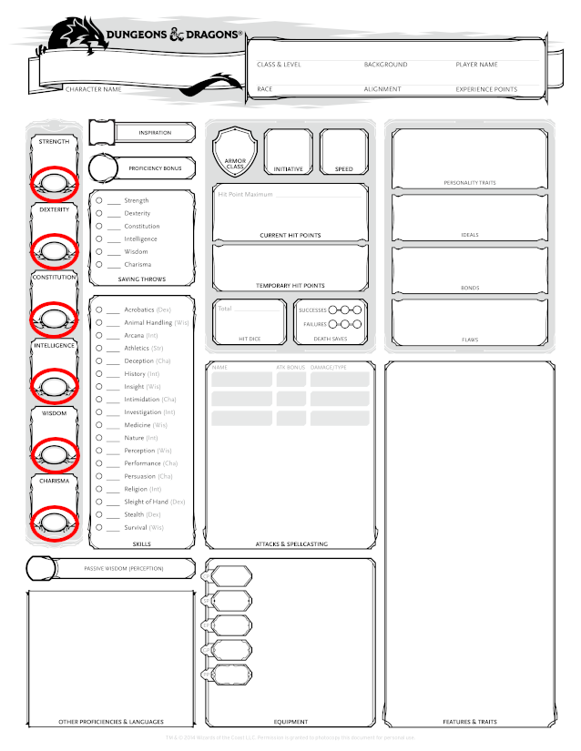
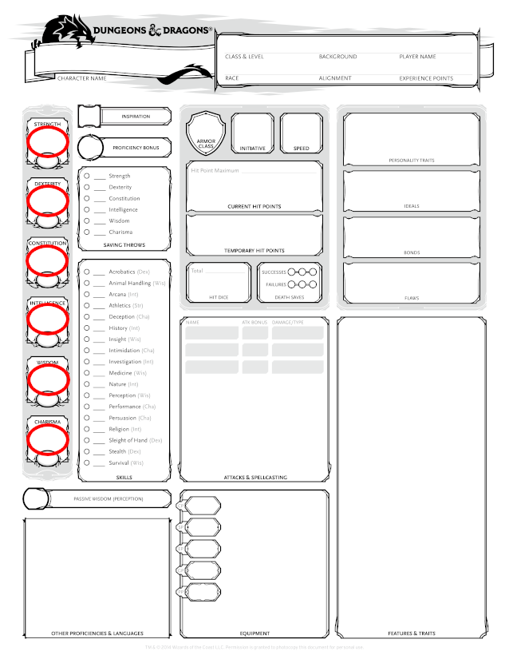
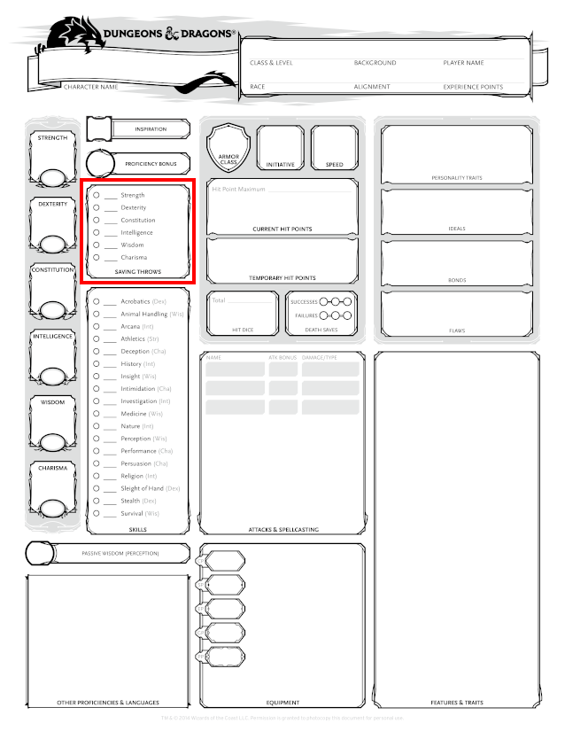
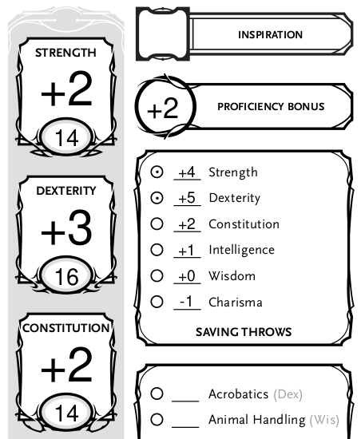
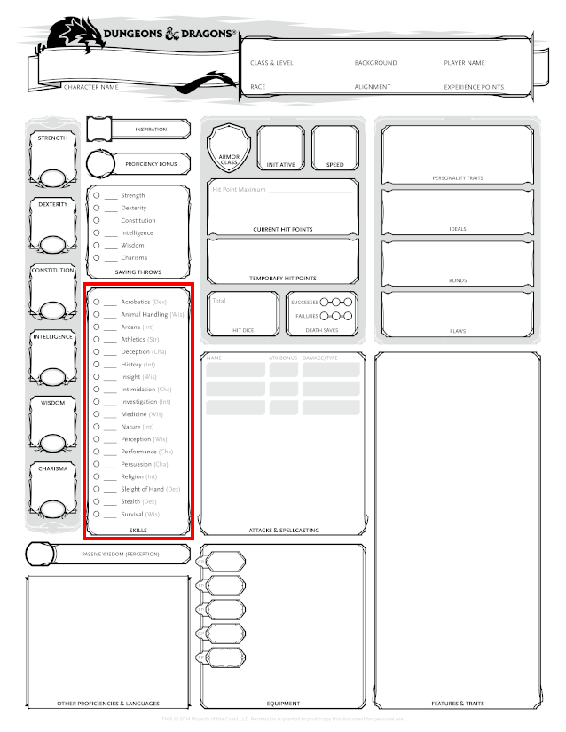
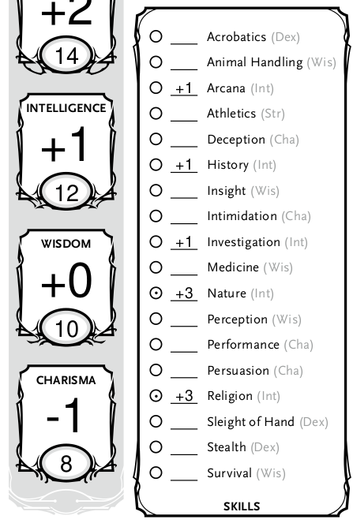
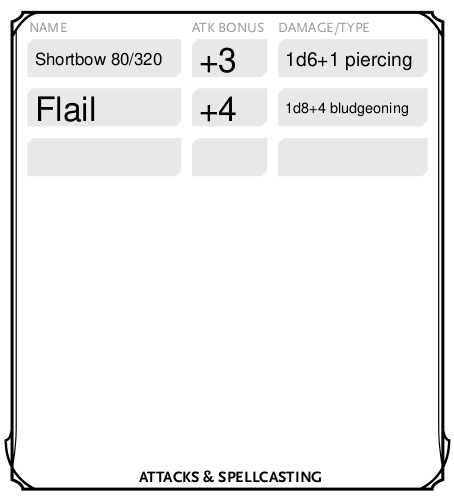

# What is affected by you changing your ability scores

## Ability Score

  
Where do I write / find "Ability Scores" on my character sheet?

  

  
What does "Ability Score" mean
  

  TODO

  
How do I calculate "Ability Score"

  TODO link to standard array / point buy.

## Ability Modifier

  
Where do I write / find "Ability Modifiers" on my character sheet?

  

  
What does "Ability Modifier" mean
  

  TODO

  
How do I calculate "Ability Modifier"

  You calculate your Ability Modifier for each Ability Score using the following formula, rounded down:

  > Ability Modifier = ( Ability Score - 10 ) / 2

  For example; if you have a strength score of 13. You would get a Strength Ability Modifier of `(13-10)/2 = 1.5`, rounded down to +1.

| Ability Score | Modifier |
|---------------|----------|
|  1 |	−5 |
|2–3| 	−4 |
|4–5| 	−3 |
|6–7| 	−2 |
|8–9| 	−1 |
|10–11| 	+0 |
|12–13| 	+1 |
|14–15| 	+2 |
|16–17| 	+3 |
|18–19| 	+4 |
|20–21| 	+5 |
|22–23| 	+6 |
|24–25| 	+7 |
|26–27| 	+8 |
|28–29| 	+9 |
|30| 	+10 |
  

## Saving Throws

  
Where do I write / find "Saving Throws" on my character sheet?

  

  
What does "Saving Throws" mean
  

  Saving Throws are often used when your character is reacting to something. For example you might roll a Dexterity Saving Throw, to see if you are able to avoid the fireball being thrown in your direction. Or you might roll a Constitution saving throw, to see how well you withstand the effects of drinking a poisoned drink.

  In order to roll a Saving Throw, you roll a d20 and add the relevant modifier.

  
How do I calculate "Saving Throws"?

  Your Saving Throw modifier for each Ability is equal to your Ability Modifier for that ability.
  
  You might be "proficient" in some types of saving throws (for example from your class). In that case you mark the circle in front of the Saving throw line and add your proficiency bonus to the ability modifier.

  For example "Freth" is a 2nd level Ranger. Freth has a dexterity modifier of +3. His class/level gives him a proficiency bonus of +2. Since he is a Ranger he is proficient in dexterity saving throws. Freth marks the circle in front of dexterity saving throws and writes +5 on the line.

  

## Skills

  
Where do I write / find "Skills" on my character sheet?

  

  
What do "Skills" mean
  

  Skills are very similar to saving throws. They are most often used to determine your characters ability to perform an action.

  Your DM might ask you to roll an Investigation check, in order to see how much information you are able to find in the books of an old library.

  To roll an Investigation check, you would roll a d20 and add the skill modifier written next to Investigation in your character sheet. A 10 might reveal the name of an author who wrote many of the books. Whereas a 15 might reveal that the author was a powerful wizard.

  
How do I calculate my "Skill" modifiers

  
  
  Each skill has a corresponding ability written after it in parenthesis. Your skill modifier for "Arcana" is based on Intelligence.
  
  Freth has an Intelligence modifier of +1, therefore his Arcana modifier becomes +1.

  Similarly to Saving Throws, you can be proficient in some skills. Usually your class, background and race give you proficiency in some skills. If you are proficient in a skill, you mark the circle in front of that skill and add your proficiency bonus to the modifier.

  Freth is proficient in Nature and Religion and thus has a modifier of +3 in those skills.

## Passive Perception

  
Where do I write / find "Passive Perception" on my character sheet?

  Underneath your skills.

  
What does "Passive Perception" mean?

  Passive checks are used when determining how well a character responds to a situation without actively being aware of it.

  Passive Perception might, for example, be used to determine if your character notices somebody stealing their coinpurse. Asking you as a player to roll a dice would reveal that "something" is going on.

  
How do I calculate my "Passive Perception"

  Passive skill checks are calculated as:

  > 10 + all modifiers that normally apply to the check
  
  If your character has a +1 modifier in the perception skill, their passive perception becomes 11.

## Hit Points

We use fixed average values to calculate character HP (there are variants with more randomness involved).

  
How do I calculate my "Max HP"

Your class gives you a certain type of "hit dice":

|Classes|Hit dice type| Dice average rounded up|
|-------|-------------|--|
|Barbarian| d12| 7
|Paladin, Fighter, Ranger| d10| 6
|Monk, Druid, Rogue, Bard, Cleric Warlock| d8| 5
|Wizard, Sorcerer| d6| 4

"Fump" is a 1st level Wizard with a constitution modifier of +2.
At level 1 their HP is equal to the maximum roll of the wizard hit dice + constitution modifier `6 + 2 = 8`.

At level 2 they add the hit dice average rounded up + constitution modifier `4+2` for a total of `14` max HP.

At level 3 they do the same and have a new max HP value of `20`.

At level 4 Fump increases their constitution modifier to +3. This change is applied retroactively so their HP for each level changes as follows:
|Level|Dice|Constitution modifier| New max HP
|-|-|-|-
|1|6|+3|9
|2|4|+3|16
|3|4|+3|23
|4|4|+3|30

Giving them a new max HP of 30.

At level `n` a characters max HP can be calculated as:
`(hit dice max) + (n-1) * (hit dice average) + n * (current constitution modifier)`

Using Fump at level 4 as an example we get
`6 + (4-1)*4 + 4*3 = 30`

## Armor Class

  
How do I calculate my "Armor Class"

  If you are not wearing any armor, your AC is equal to 10 + your dex modifier.

  If you are wearing armor [look up](https://5e.tools/book.html#phb,-1,armor%20and%20shields,0) the type of armor you are wearing to figure out your AC. Usually it is a fixed number + your dex modifier.

  You can increase your AC in other ways. For example holding a shield increases your AC by an additional 2. Some Races and class features increase or modify AC as well.

## Initiative

Your initiative modifier is usually equal to your dexterity modifier. It might however be modified by your class or feats.

## Weapon Attacks

  
How do I calculate my weapon hit chance and damage.

  Depending on the weapon you are using, you apply a different modifier:
  |Weapon type/keyword| Ability used for it|
  |-------------------|-----------------|
  | Melee weapon | Strength |
  | Ranged weapon | Dexterity |
  | Weapon with "finesse" | Your choice of Strength/Dexterity|
  | Others | Might be different |

  When attacking with your weapon, you first roll a d20 and add the appropriate ability modifier (see the table above). If you are proficient with this weapon, you also add your proficiency bonus. We write the sum of these modifiers into the column named "Atk Bonus", next to the name of the weapon.
  
  If your roll is greater or equal to the AC of your enemy, you roll to determine how much damage you do. The description of your weapon tells you which die you should use. Roll the die and add the appropriate ability modifier (see the table above). We write the dice type, the modifier and the damage type into the "Damage/Type" column, next to the "Atk Bonus" column.

  Our Cleric "Ambovakri" has a dexterity modifier of +1, a strength modifier of +4 and a proficiency bonus of +2. She uses two weapons, a shortbow and a flail.

  The shortbow uses dexterity as a modifier (+1). Ambovakri is also proficient with "simple weapons" (+2). Therefore we write `+3` in the "Atk Bonus" column.

  The shortbow description tells us that shortbows do "1d6 piercing damage". Ambovakri also adds her dexterity modifier to this. So we write `1d6+1 piercing` into the "Damage/Type" column.

  The flail uses strength as it's modifier (+4). Ambovakri is not proficient with martial weapons. Therefore we write `+4` in the "Atk Bonus" column.

  The flail does "1d8 bludgeoning" damage, so we write `1d8+4 bludgeoning` in the "Damage/Type" column.

  For ranged weapons it is often useful to know the range of the weapon. We write this after the name.

  

